---
title: 'The Cultural Mapping and Pattern Analysis (CMAP) Visualization Toolkit: Open Source Text Analysis for Qualitative and Computational Social Science'
tags:
  - computational social science (css)
  - qualitative data analysis (qda)
  - mixed-methods research
  - data visualization
  - open source software
  - natural language processing (nlp)
  - machine learning (ml)
authors:
  - name: Corey M. Abramson
    orcid: 0000-0001-6306-6910
    equal-contrib: true
    affiliation: "1, 2, 3, 4, 5, 6, 7"
  - name: Yuhan (Victoria) Nian
    orcid: 0009-0006-2603-7479
    equal-contrib: true
    corresponding: true
    affiliation: "2, 8"
affiliations:
  - name: Associate Professor of Sociology, Department of Sociology, Rice University, United States
    index: 1
  - name: Computational Ethnography Lab, Rice University, United States
    index: 2
  - name: Co-Director, Center for Computational Insights on Inequality and Society (CIISR), Rice University, United States
    index: 3
  - name: Affiliated Faculty, Institute of Health Resilience and Innovation (IHRI), Rice University, United States
    index: 4
  - name: Affiliated Faculty, Ken Kennedy Institute (Responsible AI and Scientific Computing), Rice University, United States
    index: 5
  - name: Faculty, Medical Cultures Lab, University of California San Francisco, United States
    index: 6
  - name: Affiliated Faculty, Center for Ethnographic Research, University of California Berkeley, United States
    index: 7
  - name: Department of Statistics, Rice University, United States
    index: 8
date: 27 September 2025
bibliography: paper_ref.bib
---


# Summary
The CMAP (cultural mapping and pattern analysis) visualization toolkit is an open-source suite for analyzing and visualizing qualitative text data—from fieldnotes and interview transcripts to historical documents and web pages—designed for scholars integrating pattern analysis, visualization, and alternative explanations within qualitative and/or computational social science (CSS). Despite off-the-shelf QDA software, there is little in the way of highly scalable or open source options, particularly those with transparent and adjustable statistics. The foundation of the toolkit is a pragmatic approach that aligns research tools with social science project goals—empirical explanation, theory-guided measurement, comparative design, or evidence-based recommendations—guided by the principle that research questions should determine methods.


# Statement of need 
This builds on sociological traditions of multi-method analysis, triangulation, and purposive computation to link levels of analysis and generate insights of scientific and practical importance [@dubois1899philadelphia; @lamont2009workshop; @small2011mixed]. Computational tools in this framework expand human inquiry, continuing a trajectory from statistical computing, qualitative data analysis software, CSS text analyses, and visualization to open science. The toolkit recognizes that computation is already embedded in research and daily life—from CAQDAS software to search algorithms—and can be used thoughtfully to advance sociological inquiry and ensure emergent technologies address pressing social issues [@abramson2025pragmatic; @grimmer2022text; @healy2014data; @nelson2020computational; @breiger2015scaling; @dohan1998using; @peponakis2023calculations; @fourcade2024ordinal].  

CMAP includes cutting-edge visualization options that are open source and accessible to those without extensive Python programming experience, making it adaptable as both a pedagogical and research tool—addressing core issues of training and accessibility important for expanding CSS proficiencies for qualitative researchers [@abramson2025pragmatic]. The toolkit supports advanced analytic methods appropriate for computational text analysis alongside in-depth readings—including co-occurrence, clustering and embedding approaches—with visuals such as heatmaps, t-SNE dimensional reduction plots (like a scatter plot, with words), semantic networks, word clouds, and more. Examples work with common qualitative data sources and allow granular analysis that mirrors qualitative practices (at the level of words, sentences, paragraphs), yet scale for large datasets produced by teams.  

CMAP visualizations are designed for integration into research papers and pedagogical applications, addressing the dearth of open-source software accessible to qualitative researchers seeking scalable analytical tools with transparent statistical foundations. The toolkit runs efficiently on consumer grade hardware, without extensive setup.  

The main paper charts organization and functions. Full mathematical details, related software resources, and representative scientific applications are provided in the Appendix.


# CMAP Organization 
CMAP can be run in either a Jupyter environment [via Github](https://github.com/Computational-Ethnography-Lab/cmap_visualization_toolkit.git) or Google Colab [Colab Link](https://colab.research.google.com/drive/1n90EDMSiXhIaOULUMPJ4W4hqdZCh1NQw?authuser=1#scrollTo=1jgH13I3xLbA&uniqifier=1). 
Colab is recommended for learning the methods and experimenting with public datasets. For sensitive data or extended development, users can clone the GitHub repository and run the included installation script locally. 

```bash
git clone https://github.com/Computational-Ethnography-Lab/cmap_visualization_toolkit.git
cd cmap_visualization_toolkit
chmod +x install.sh
./install.sh
```

The repository contains several key files:

- .sh — installation and environment setup
  
- .py — core mathematical functions for similarity, clustering, and network layout
  
- .ipynb — the main program with workflows for importing, validating, cleaning, modeling, and visualizing text [@grimmer2022text; @abramson2025pragmatic]

The main program is organized into modular execution blocks (e.g., Imports, Validation, Helper Functions, Visualization) as shown in (\autoref{package_load}, \autoref{helper_functions}, \autoref{validator}), which correspond to each step in the text-visualization pipeline (\autoref{flowchart}). To illustrate this structure, we include example code screenshots from each section of the toolkit below. This modular design allows users to flexibly adapt CMAP for both small-scale classroom applications and large collaborative research projects.

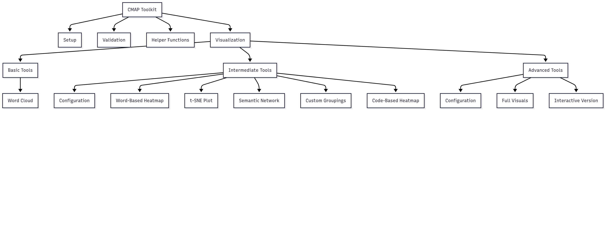{width=80%}

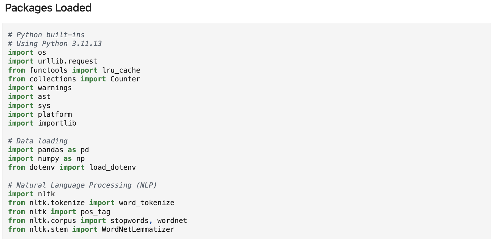{width=70%}

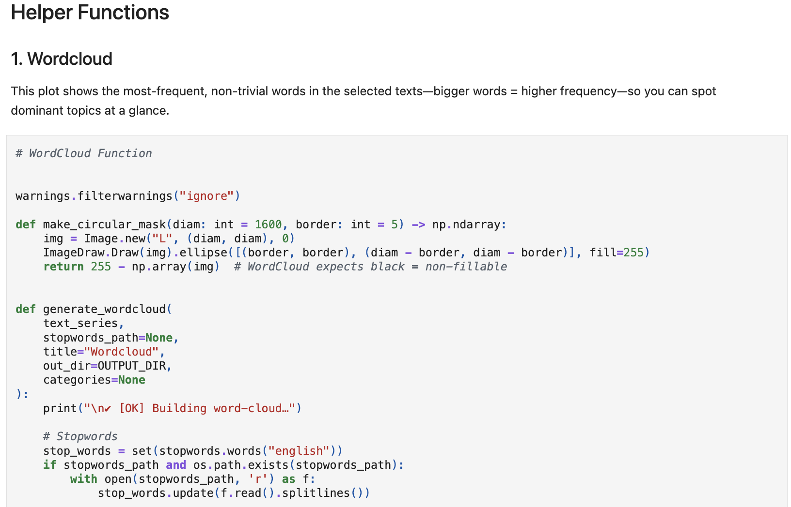{width=70%}

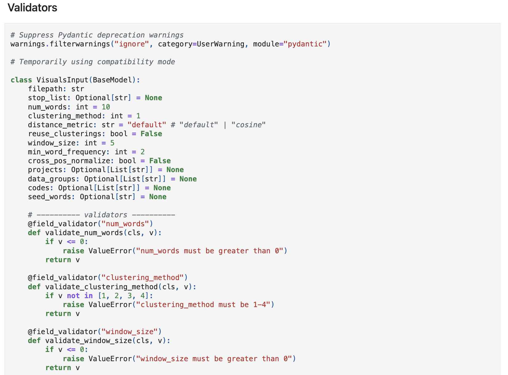{width=70%}


# Functions 
CMAP provides four options for measuring relationships between words or concepts. Each emphasizes a different type of connection (for detailed mathematical implementations, see Appendix):

- **RoBERTa (Semantic Similarity)** – Finds words used in conceptually similar ways using dynamic contextual embeddings [@liu2019roberta]. Best for uncovering analogies and latent meanings (e.g., success → money, happiness, family). The embedding model can be changed to use fine-tuned or specialized models. 

- **Co-occurrence (Jaccard or Cosine Similarity Distance)** – Best for identifying direct vocabulary associations in the same text segments (e.g., success → hard work, effort).
  - Jaccard index: set-based, binary overlap score (emphasizes whether words co-occur at all).
  - Cosine similarity: compares frequency-sensitive context vectors built from co-occurrence counts.

- **PMI (Pointwise Mutual Information)** – Highlights words that co-occur more often than expected by chance. Best for finding statistically significant pairings.

- **TF–IDF (Term Frequency–Inverse Document Frequency)** – Detects distinctive words that are unusually important in a given segment [@manning2008introduction; @newman2010networks].
By default, CMAP applies **cosine similarity** to vector-based methods, balancing interpretability and sensitivity in accordance with common practices in computational social science. Alternative options (e.g., Jaccard overlap, raw-weighted TF–IDF) allow researchers to emphasize overlap, context, or frequency.

# Visualization  
CMAP produces multiple visual outputs that allow researchers to explore relationships at different levels (words, sentences, paragraphs) and scale to large collaborative datasets. These mirror pragmatic mixed-methods principles while enabling scalable analysis, and are adjustable by users.

- **Word Clouds** \autoref{word_cloud} – Highlight the most frequent and salient terms across a dataset or within filtered subsets, and allow color coding by theme. 

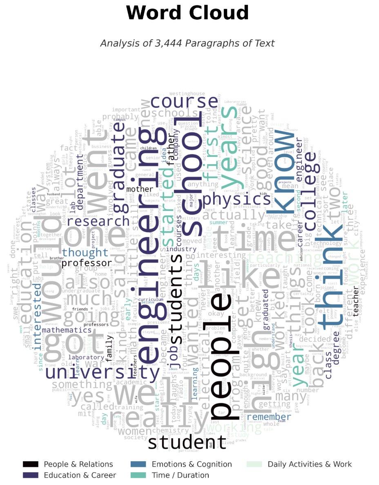{width=32%}

- **t-SNE Semantic Maps** \autoref{tsne} – Reduce high-dimensional similarity matrices into 2D plots, emphasizing seed words for interpretability.

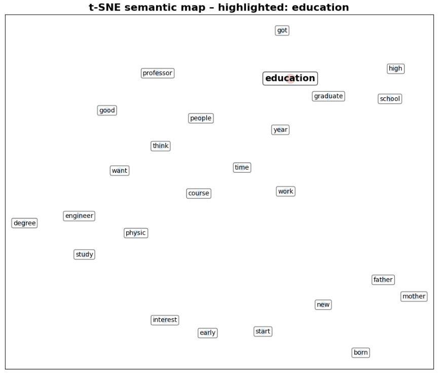{width=32%}

- **Word Heatmaps** \autoref{heatmap} – Show how concepts or "codes" (meta-data used to index text, like #morality_talk) relate to each other on a color coded table with options for clustering.
  - Basic Heatmap – clusters keywords by similarity.
  - Code Co-Occurrence Heatmaps – Display the frequency with which qualitative codes appear together in the same entries.
  - 
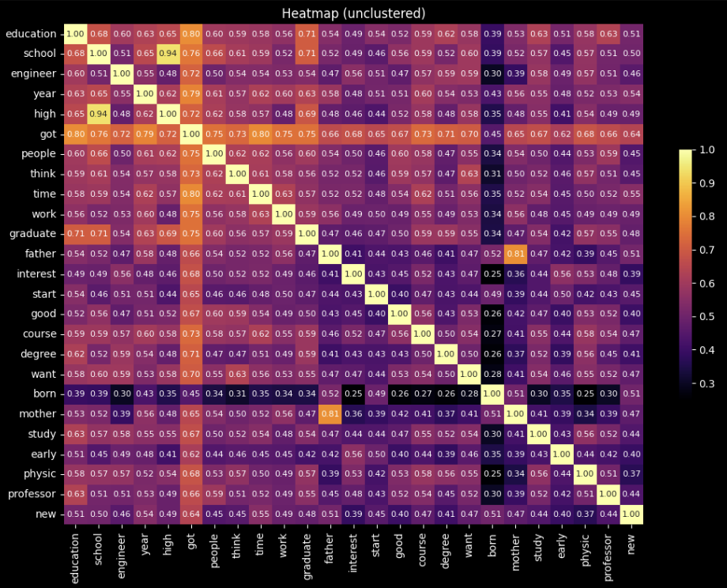{width=32%}

- **Semantic Networks** \autoref{semantic_network} – Visualize relationships among codes or concepts as nodes and edges, with edge weights reflecting co-occurrence or similarity. Users can define custom semantic groups inductively (e.g., from heatmaps or deep reading) or deductively (via theory-driven categories). Normalized cosine similarity scores (1–5) can highlight the strongest links between clusters, and options for styling (color, edge thickness, clustering). Always presented with heatmaps for inductive cross reference.
  - Heatmap + Network (Plain) – overlays a basic network on the heatmap.
  - Heatmap + Network (Colored) – adds colored clusters, semantic links, and optional edge styling.

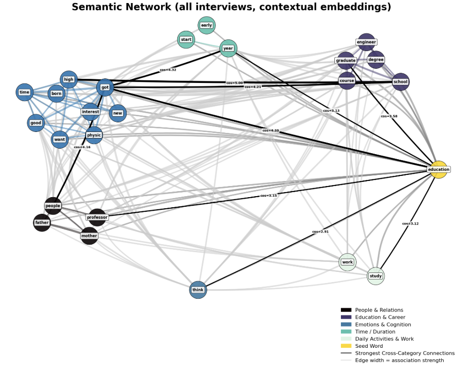{width=32%}


The examples shown below use qualitative interview data (\autoref{example_csv}) described in [@abramson2015beyond], but CMAP can be applied to any properly formatted .csv dataset.
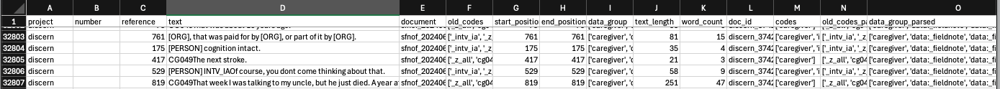{width=70%}


Any data can be used as long as it includes the required fields from the schema below (\autoref{schema}).

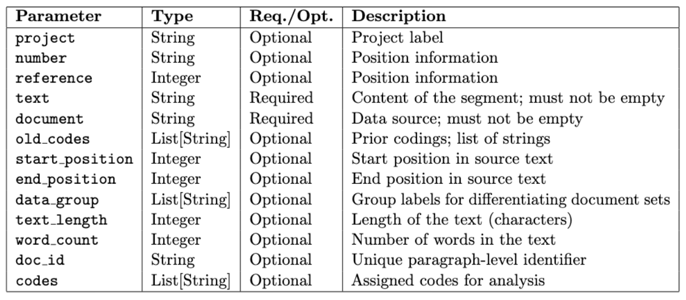{width=70%}


All parameters are configurable in labeled execution blocks (\autoref{config}), which set how the visuals are produced. For instance short text windows and few words for syntactic analyses, larger windows and more seeds to look at overlapping themes. Users can designate colored grouping to correspond to deeper readings of text [@abramson2024inequality].  

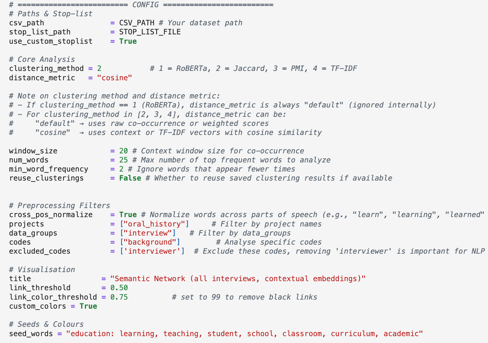{width=70%}

# Conclusion
CMAP addresses the critical gap in open-source, scalable analytical tools for qualitative researchers, providing transparent statistical foundations suitable for both research publication and pedagogical applications.

# Acknowledgements
Aspects of this research were supported by National Institute on Aging of the National Institutes of Health (NIA/NIH) award DP1AG069809 (Dohan PI). Content and views are those of the authors not of NIH.  
We thank Daniel Dohan, Zhuofan Li, Tara Prendergast, Kieran Turner, Jakira Silas, Kelsey Gonzalez, Alma Hernandez, Ignacia Arteaga, Melissa Ma, Brandi Ginn, and Zain Khemani for their feedback. We also acknowledge participants in "Trends in Mixed-Methods Research," a panel on "Computational and Mathematical Approaches to Qualitative and Quantitative Data" organized by Laura Nelson at the American Sociological Association, and attendees of workshops including An Introduction to Machine Learning for Qualitative Research and the American Sociological Association Methodology Workshop (with Li and Dohan).

## Author Contributions
C.M.A. led project conceptualization, software architecture, software development, manuscript preparation, and test of teaching materials. Y.N. contributed equally to manuscript writing, preparation and software implementation. Both authors contributed to all aspects of the work including writing and testing code.

# References

::: {#refs}
:::


\newpage

# Appendix

## Statistics

### RoBERTa
We employ RoBERTa, a transformer-based language model [@liu2019roberta], to obtain 
contextual token embeddings. Each paragraph in the corpus is tokenized, and subword tokens are mapped to hidden states from the final layer of the model. Consecutive subword tokens belonging to the same lexical unit are aggregated into word-level embeddings by averaging their hidden state vectors. To reduce morphological variance, each word is lemmatized.

Formally, let $x = (t_1, t_2, \dots, t_n)$ denote a sequence of tokens and 
$\mathbf{h}_i \in \mathbb{R}^d$ the hidden representation of token $t_i$ from the final layer of 
RoBERTa. For a word $w$ composed of tokens $\{t_{i}, \dots, t_{j}\}$, its embedding is:

$$
\mathbf{v}_w = \frac{1}{j-i+1} \sum_{k=i}^{j} \mathbf{h}_k
$$

All occurrences of a word across the corpus are then averaged to form its 
document-level representation:

$$
\bar{\mathbf{v}}_w = \frac{1}{N_w} \sum_{m=1}^{N_w} \mathbf{v}_w^{(m)},
$$

where $N_w$ is the number of times word $w$ appears.

To identify candidate words most semantically related to the seed set $S$, 
we compute the cosine similarity between embeddings:

$$
\text{cos}(\mathbf{u}, \mathbf{v}) \;=\; 
\frac{\mathbf{u} \cdot \mathbf{v}}{\|\mathbf{u}\| \, \|\mathbf{v}\|}
$$

For each candidate word $c$, its score is the average similarity to the seed embeddings:

$$
\text{score}(c) = \frac{1}{|S|} \sum_{s \in S} 
\text{cos}(\bar{\mathbf{v}}_c, \bar{\mathbf{v}}_s)
$$

The top-ranked words by $\text{score}(c)$ are selected to expand the seed set, and the resulting embeddings are used to construct a cosine similarity matrix for subsequent clustering and network analysis.

### Jaccard

Jaccard similarity measures how much two sets overlap. A value of $1$ means the sets are identical, while $0$ means they share nothing in common:

$$
\mathrm{Jaccard}(A,B) = \frac{|A \cap B|}{|A \cup B|}
$$

**Implementation** For each pair of words $w_i$ and $w_j$, we collect the unique context words that appear within a sliding window around them, denoted $\mathcal{C}_{w_i}$ and $\mathcal{C}_{w_j}$. Their Jaccard score tells us how similar the two context sets are. A higher score means the words tend to appear with similar neighbors, making them more closely linked in the semantic network.

### PMI and PPMI

Pointwise Mutual Information (PMI) measures how strongly two words are linked compared to what we would expect if they were independent. A positive PMI means the words appear together more often than chance, while a negative PMI means they appear together less often. To keep the measure stable and interpretable, we use Positive PMI (PPMI), which replaces all negative values with zero. For example, the pair *"New"* and *"York"* has a high PPMI because they almost always occur together, whereas *"New"* and *"banana"* would have a PPMI close to zero.

$$
\mathrm{PMI}(x,y) = \log_2\frac{P(x,y)}{P(x)P(y)}, \quad
\mathrm{PPMI}(x,y) = \max(0,\mathrm{PMI}(x,y))
$$

**Implementation.** We build a co-occurrence matrix by sliding a context window across the corpus. From these counts we estimate probabilities $p_{ij}$, $p_i$, and $p_j$, and compute

$$
e^{\mathrm{PPMI}}_{w_i,j} = \max\left(0, \log_2 \frac{p_{ij}}{\max(\varepsilon,p_i)\max(\varepsilon,p_j)} \right)
$$

Here $p_{ij}$ is the probability that anchor $w_i$ and context word $c_j$ co-occur, and $\varepsilon$ (e.g., $10^{-10}$) prevents division by zero. We then apply cosine similarity to the resulting PPMI vectors to compare words in the semantic network.

### TF–IDF

Term Frequency–Inverse Document Frequency (TF–IDF) assigns higher weight to a term if it is frequent in a given context but relatively rare across the entire corpus. This makes it useful for identifying words that are especially informative, rather than just common.

$$
\mathrm{tfidf}(t,d,\mathcal{D}) = \mathrm{tf}(t,d) \cdot \log \frac{|\mathcal{D}|}{\mathrm{df}(t)}
$$

where $\mathrm{tf}(t,d)$ is the frequency of term $t$ in document $d$, and $\mathrm{df}(t)$ is the number of documents containing $t$ in the corpus $\mathcal{D}$.

**Implementation** For anchor $w_i$ and context $c_k$ with raw count $v_{w_i,k}$, we weight each context by its TF–IDF score:

$$
e^{\mathrm{T}}_{w_i,k} = v_{w_i,k} \cdot \mathrm{tfidf}(c_k)
$$

Cosine similarity between rows of $e^{\mathrm{T}}$ gives an anchor-to-anchor similarity matrix, showing how strongly two words are connected through their distinctive contexts. For example, *doctor* and *hospital* may yield a high similarity score because they share informative context words, while *doctor* and *banana* will score low.

### Raw Context–Count Vectors

The simplest way to represent a word is to count how often other words appear near it. For each target word $w_i$, we slide a fixed window of size $w$ across the corpus. Every time $w_i$ occurs, we look at the surrounding context words in that window (including $w_i$ itself) and add one to their counts. This gives a vector $\vec{v}_{w_i}$ where each entry $v_{w_i,k}$ records how often context word $c_k$ appears near $w_i$.

$$
v_{w_i,k} = \sum_{\text{sent}\in\mathcal{D}} \sum_{\substack{p:\,\text{sent}[p]=w_i}} \sum_{q=\max(0,p-w)}^{\min(|\text{sent}|-1,p+w)} \mathbf{1}\{\text{sent}[q]=c_k\}, \quad \vec{v}_{w_i}=(v_{w_i,1},\dots,v_{w_i,n})
$$

After building these vectors, we compute cosine similarity between them to measure how similar two words' contexts are. For example, if *"doctor"* and *"nurse"* often appear near similar words (*"hospital," "patient," "care"*), their vectors will be close, and cosine similarity will assign them a high score.

## Distance Metric 

Given $E^\phi \in \mathbb{R}^{m \times n}$ with rows $(\vec{e}^{\,\phi}_{w_i})^T$,

$$
S^{\phi}_{ij} = \cos(\vec{e}^{\,\phi}_{w_i}, \vec{e}^{\,\phi}_{w_j}) = \frac{\vec{e}^{\,\phi}_{w_i} \cdot \vec{e}^{\,\phi}_{w_j}}{\|\vec{e}^{\,\phi}_{w_i}\| \, \|\vec{e}^{\,\phi}_{w_j}\|}
$$

Cosine similarity measures how close two word vectors are in direction, regardless of their length. For two embeddings $\vec{e}^{\,\phi}_{w_i}$ and $\vec{e}^{\,\phi}_{w_j}$, it is defined as the cosine of the angle between them. Values near $1$ indicate strong semantic similarity, while values near $0$ or negative suggest weak or opposite meaning. For example, the vectors for *doctor* and *nurse* would yield a high cosine similarity, reflecting their related meanings, whereas *doctor* and *banana* would yield a value close to $0$. This makes cosine similarity a simple and effective tool for comparing words in our semantic network analysis.

## Other Resources
### Workflow Steps Example (End-to-End)
The workflow for analyzing text as data is iterative. This synthesized workflow integrates pragmatic qualitative steps [@abramson2025pragmatic; @li2025ethnography] with frameworks established in CSS [@grimmer2022text].  
- **Define Question/Theory**  
Specify the research question or Quantity of Interest (QoI). Work may begin inductively [@nelson2020computational] or deductively [@grimmer2022text].  
- **Aggregation (Building the Corpus)**  
Define population, sampling frame, and document units. Data sources can include transcribed interviews, ethnographic fieldnotes, historical documents, webscraped data, policy documents, administrative text, or open-ended survey responses. Record provenance and metadata.    
>*Python Tools:* pandas for manifests; requests + beautifulsoup4 (web scraping), or API clients. Store as JSONL/CSV + raw text. Export from QDA >software, or integrate text into a data frame.  
- **Digitization and Processing (Data Wrangling)**  
*Digitization (OCR & QA):* Convert PDFs/scans. Perform manual Quality Assurance (QA). Choose digitization to preserve meaningful structure (speaker turns, page breaks) for citation integrity.   
*Processing:* Clean and format text into machine-readable and tabular formats (see Schema below). Data can be imported from QDA software or read directly from .txt (UTF-8) files. Tokenize/segment and normalize.  
>*Python Tools:* pytesseract (OCR); spaCy (normalization/tokenization).  
- **Representation**  
Transform text into formats suitable for computational analysis. Choose representations (BOW/TF-IDF, dictionaries, embeddings) to fit the QoI. This involves visualizing patterns, combined with readings.    
*Python Tools:* scikit-learn vectorizers (DTM/TF-IDF); Hugging Face transformers (Embeddings).
- **Annotating and Linking**  
>*Annotating:* Build human system for indexing data. Utilize a hybrid approach—combining automation (lists, machine learning) and human coding >depending on scope and complexity [@abramson2025pragmatic]. This involves managing tradeoffs: while accuracy is key for a realist approach, >time efficiency and identifying insights otherwise missed are also crucial considerations. Entity tagging (persons/orgs/places) via spaCy NER.
> 
>*Linking:* Join texts to variables in dataframe (site, time, treatment, demographics) for comparison and modeling. If using qualitative >software or purposeful file naming, this can be done with minimal work [@li2025ethnography].    
>*Python Tools:* spaCy NER; pandas (linking).  
- **Analysis, Modeling & Visualization**    
*Descriptions & Visualization:* LDA topics + human validation ("Reading Tea Leaves"); word-embeddings for schemas combined with in-depth narrative [@abramson2024inequality]. Use visualization tools (e.g., CMAP) to explore patterns and comparisons [@abramson2015beyond].    
>*Modeling:* Supervised coding/stance with scikit-learn baselines and transformers (BERT-class); report metrics, calibration, and error >analysis. Combine unsupervised exploration (topics/clusters) with supervised measurement/prediction.
>*Deep Reading & Interpretation:* Always return to exemplar passages to contextualize model patterns (scale down), examine disconfirming cases, >update explanations to account for data while noting contextual limits.
- **Dissemination and Archiving**    
Reproducible Jupyter notebooks (see workshop repo), CMAP visualizations, codebooks, curated quotes. Pair patterns + passages in presentation. Archive code/data where allowed; follow de-identification guidance and document limits/ethics.  
### Data Schema Example (CMAP)
For structured analysis and visualization (e.g., using the CMAP toolkit), data should be organized into a consistent tabular format (e.g., CSV or DataFrame). Below is an example schema:
```
# Updated schema with Python typing
schema = {
    "project": str,         # List project
    "number": str,          # Position information
    "reference": int,       # Position information
    "text": str,            # Content, critical field: must not be empty
    "document": str,        # Data source, Critical field: must not be empty
    "old_codes": list[str], # Optional: codings, must be a list of strings
    "start_position": int,  # Position information
    "end_position": int,    # Position information
    "data_group": list[str], # Optional, to differentiate document sets: Must be a list of strings
    "text_length": int,     # Optional: NLP info
    "word_count": int,      # Optional: NLP info
    "doc_id": str,          # Optional: NLP info, unique paragraph level identifier
    "codes": list[str]      # Critical for analyses with codes, Must be a list of strings
}
```
### Modes of Combining Computation and Qualitative Analysis
A key consideration is how—or whether—to integrate computational tools into the analytical workflow. Researchers adopt different modes based on project needs, data sensitivity, and analytical goals [@abramson2025pragmatic].  
- **Streamline (Organizational):**    
Using computational tools to manage the logistics of research—organizing manifests, facilitating de-identification, managing quotes, automating basic indexing and tracking team progress—even if the core coding and analysis remain mostly manual.
- **Scaling-up (Efficiency/size):**    
When the corpus is large, longitudinal, or multi-site, machine learning (e.g., supervised classification) is used to assist human coding andc omputational tools are used to compile data sets of larger sizes. This may require high-quality human-labeled training data and rigorous human checks and validation (e.g., hybrid approaches).
- **Hybrid (Iterative Refinement and Mixed Methods):**   
Combining human analysis with computational methods to answer different types of questions or refine understanding, often as a form of mixed-methods like computational ethnography or historical analysis with computational text analysis. This can involve iterative coding refinement, or using computational patterns (e.g., visualization, network analysis) to identify typologies or variations that guide subsequent in-depth reading and comparison [@abramson2025pragmatic].
- **Discovery (Pattern Finding):**    
Utilizing unsupervised methods (e.g., topic modeling, clustering, visualization) to identify latent patterns, themes, or typologies that guide subsequent deep reading and theory development [@nelson2020computational]. This is compatible with human inductive reading.
- **Minimal/No Computation (The "Sociology of Computation"):**  
Deliberately choosing not to automate analysis when ethical considerations. Documenting the rationale for this choice, as any choice, is practical and important for transparency [@abramson2025pragmatic].
---
## Related Software Resources
**Li, Zhuofan and Corey M. Abramson.** 2022. *An Introduction to Machine Learning for Qualitative Research.* Jupyter Notebooks (Python). American Sociological Association Methodology Workshop. [GitHub Repository](https://github.com/lizhuofan95/ASA2022_Workshop)
**Nelson, Laura K.** 2020. "Computational Grounded Theory: A Methodological Framework." *Sociological Methods & Research* 49(1):3-42. [Article](https://journals.sagepub.com/doi/10.1177/0049124117729703) | [Homepage](https://www.lauraknelson.com/)
**Commercial Qualitative Data Software** (limited scalability for large datasets, lacks advanced CSS/statistical methods, and/or requires cloud computing):
- ATLAS.ti Scientific Software Development GmbH. 2023. ATLAS.ti Mac (version 23.2.1). https://atlasti.com
- Dedoose Version 9.0.107. 2023. Los Angeles, CA: SocioCultural Research Consultants, LLC. www.dedoose.com
- Lumivero. 2023. NVivo (Version 14). https://www.lumivero.com
---
## Representative Scientific Applications
### Peer-Reviewed Articles
- Abramson, Corey M., Tara Prendergast, Zhuofan Li, and Martín Sánchez-Jankowski. 2024. "Inequality in the Origins and Experiences of Pain: What 'Big (Qualitative) Data' Reveal About Social Suffering in the United States." *Russell Sage Foundation Journal of the Social Sciences* 10(5):34-65. [Link](https://www.rsfjournal.org/content/rsfjss/10/5/34.full.pdf)  
- Arteaga, Ignacia, Alma Hernández de Jesús, Brandi Ginn, Corey M. Abramson, and Daniel Dohan. 2025. "Understanding How Social Context Shapes Decisions to Seek Institutional Care: A Qualitative Study of Experiences of Progressive Cognitive Decline Among Latinx Families." *The Gerontologist* gnaf207. [Link](https://doi.org/10.1093/geront/gnaf207)  
- Li, Zhuofan and Corey M. Abramson. 2025. "Ethnography and Machine Learning: Synergies and Applications." In *Oxford Handbook of the Sociology of Machine Learning*, edited by [editors]. Oxford University Press. [Preprint](https://arxiv.org/abs/2412.06087)  
- Abramson, Corey M., Zhuofan Li, and Tara Prendergast. Expected 2026. "Qualitative Research in an Era of AI: A Pragmatic Approach to Data Analysis, Workflow, and Computation." *Annual Review of Sociology*. [Preprint available]
### Conference Presentations (2024-2025)
- Abramson, Corey M., Kieran Turner, Ignacia Arteaga, Alma Hernández de Jesús, Brandi Ginn, Yuhan Nian, and Daniel Dohan. 2025. "Pragmatic Sensemaking: Semantic Maps of Dementia Narratives." ARS'25: Tenth International Workshop on Social Network Analysis. Naples, Italy. [Preprint](https://arxiv.org/pdf/2509.12503)
- Abramson, Corey M., Kieran Turner,Ignacia Arteaga, Alma Hernández de Jesús, Brandi Ginn, Yuhan Nian, and Daniel Dohan. 2025. "Pragmatic Sensemaking: Mapping the Cultural Work of Living with Dementia." American Sociological Association Annual Meeting. Chicago, IL.  
- Abramson, Corey M., Zhuofan Li, and Tara Prendergast. 2024. "Qualitative Sociology in a Computational Era: Classic Issues, Emerging Trends, and New Possibilities." American Sociological Association Annual Meeting. Montreal, Canada.

